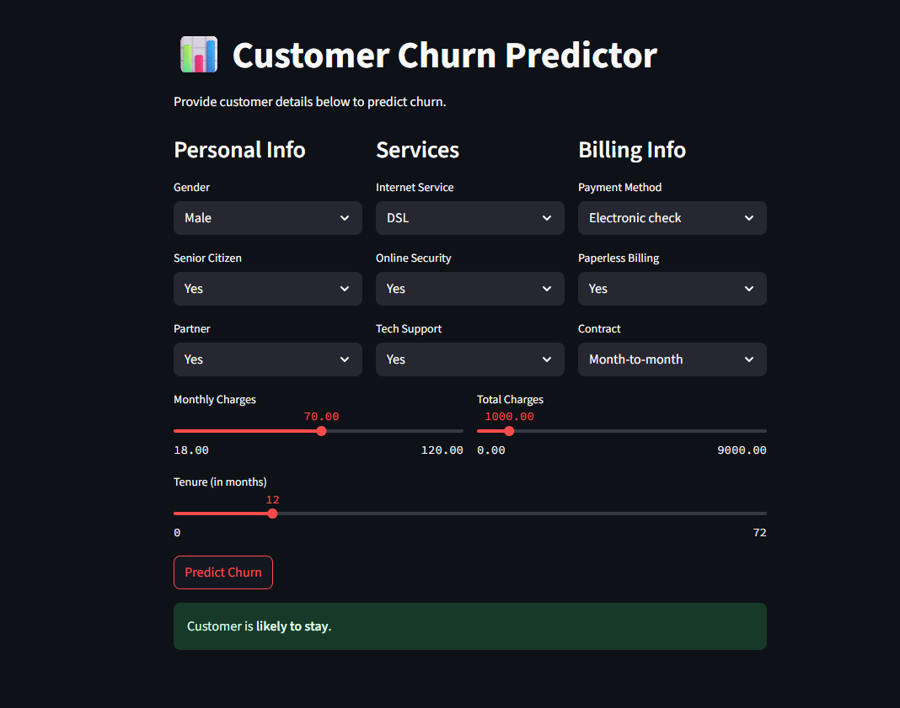
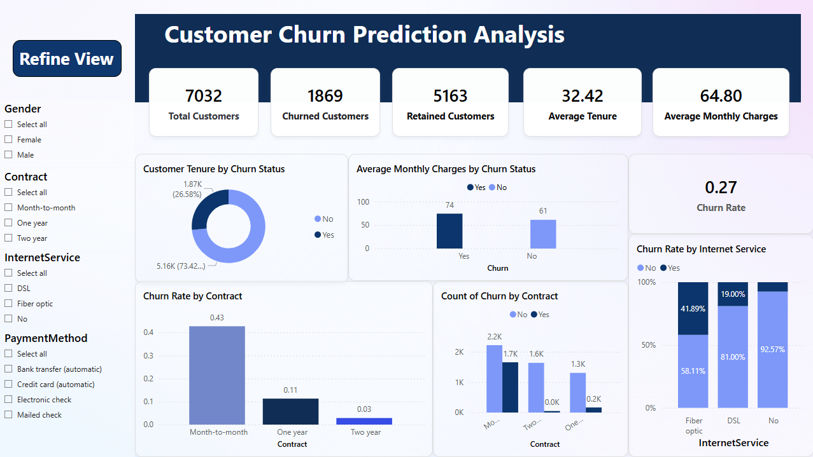
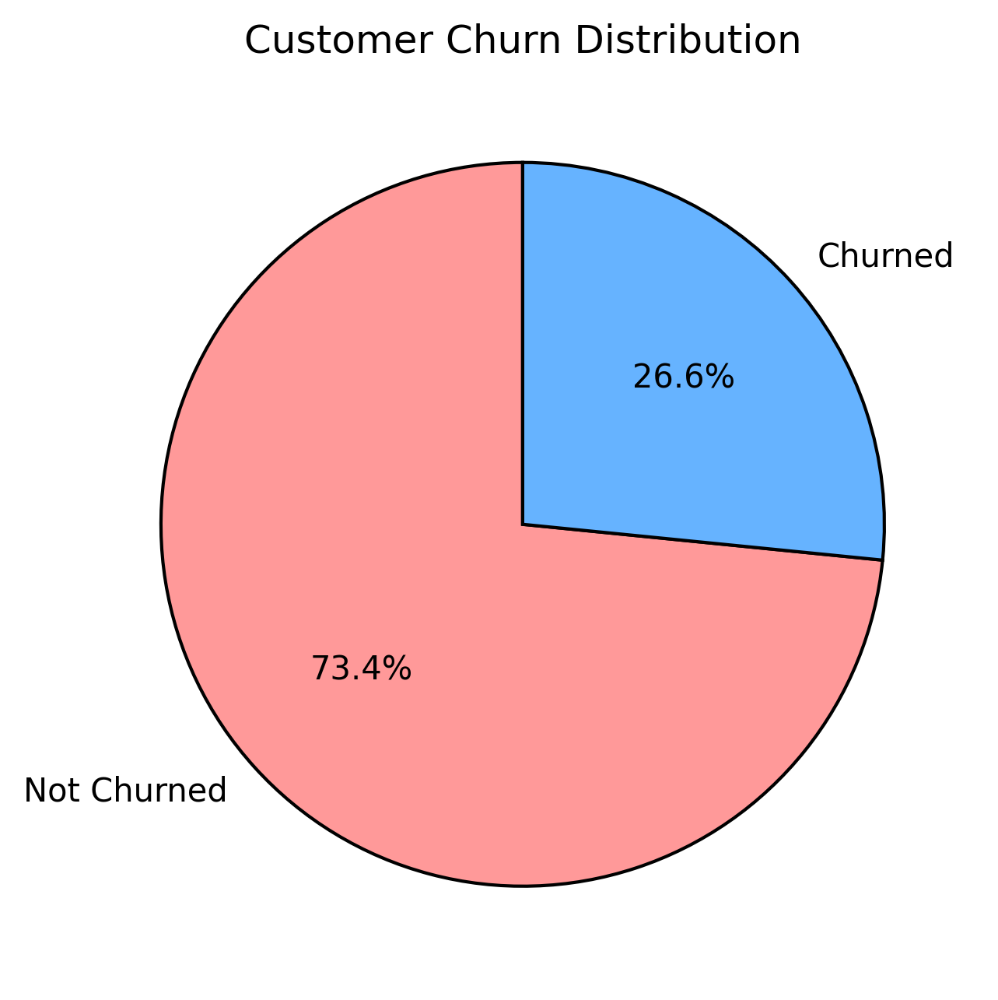

# 📊 Customer Churn Prediction (Telecom)


This project is a machine learning-based system that predicts whether a telecom customer is likely to **churn (leave)** or **stay**, based on their usage data. It includes a clean interactive web interface using Streamlit and well-organized Python scripts for training and prediction.

---

## 🖥️ Demo

> 📸 Local App Preview  
> (No online deployment — built for internship portfolio)


---
---

## 📊 Power BI Dashboard

The project also includes a fully interactive Power BI dashboard to visually explore churn patterns and insights.

📁 File: `dashboard/Customer_Churn_Dashboard.pbix`  
🖼️ Preview:



---

Key visualizations include:
- 🔹 Churn Rate by Contract Type
- 🔹 Monthly Charges vs. Tenure
- 🔹 Churn vs. Payment Method
- 🔹 Customer Segmentation by Internet Service

---
## 🚀 Features

- 🔍 Predicts customer churn using ML models (Random Forest, Logistic Regression, etc.)
- 📈 Compares multiple algorithms and selects the best-performing one
- 🧹 Cleaned dataset with EDA performed
- 🌐 Streamlit web app with sliders and glowing dark UI
- 📂 Ready-to-use GitHub project structure for internship portfolio

---

## 📁 Project Structure

Customer-Churn-Prediction/
│
├── models/ ← Final model (Random Forest with pipeline)
│ └── final_pipeline.pkl
│
├── notebooks/ ← Cleaned Jupyter notebook for EDA & modeling
│ └── Telco_EDA.ipynb
│
├── Data/ ← Raw and readable datasets
│ ├── Telco-Customer-Churn.csv
│ └── clean_telco_readable.csv
│
├── scripts/ ← Python scripts for data prep, training, and prediction
│ ├── clean_telco_data.py
│ ├── train_model.py
│ └── predict_churn.py
│
├── images/ ← EDA visualizations for README
│ ├── churn_distribution.png
│ └── churn_distribution_pie.png
│
├── app.py ← Streamlit app for real-time churn prediction
├── requirements.txt ← Python dependencies
└── README.md ← Project overview

---

## 🔍 Exploratory Data Analysis (EDA)

### 📌 Churn Distribution (Pie Chart)



---

### 📊 Churn Distribution by Class


---

### 🧪 Features Used in Modeling

We selected 12 important features based on domain knowledge and feature importance:
- `Contract`
- `tenure`
- `MonthlyCharges`
- `TotalCharges`
- `InternetService`
- `PaymentMethod`
- `OnlineSecurity`
- `TechSupport`
- `PaperlessBilling`
- `Partner`
- `gender`
- `SeniorCitizen`

---

## 💻 How to Run

### 1. Train the Model
   
```bash
python scripts/train_model.py

### 2. Predict in Terminal
  
python scripts/predict_churn.py

### 3. Run the Web App

streamlit run dashboard/app.py

---
## 📦 Requirements

Install all dependencies using:

```bash
pip install -r requirements.txt

---

 Key Highlights
 
  Clean EDA with interactive visualizations

  Accurate churn prediction using Random Forest

  SMOTE used to improve recall in class imbalance

  Deploy-ready app and organized code/scripts

  Power BI Dashboard 

## 📁 Notes

- `.gitignore` is used to keep the project clean by skipping:
  - Python cache files
  - Virtual environments
  - Unwanted system files
  - Model files (optional)

  Acknowledgements
Dataset: Kaggle Telco Customer Churn Dataset


## Project Devoloper

**Mohamed Thameem Ansar**  
**Data Analyst**

-- Thank You